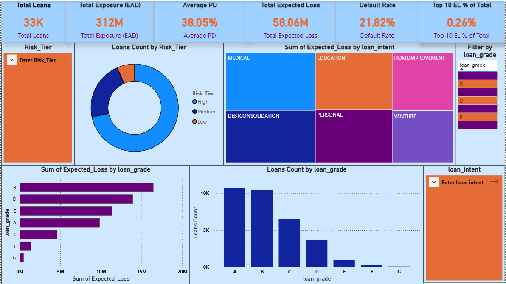
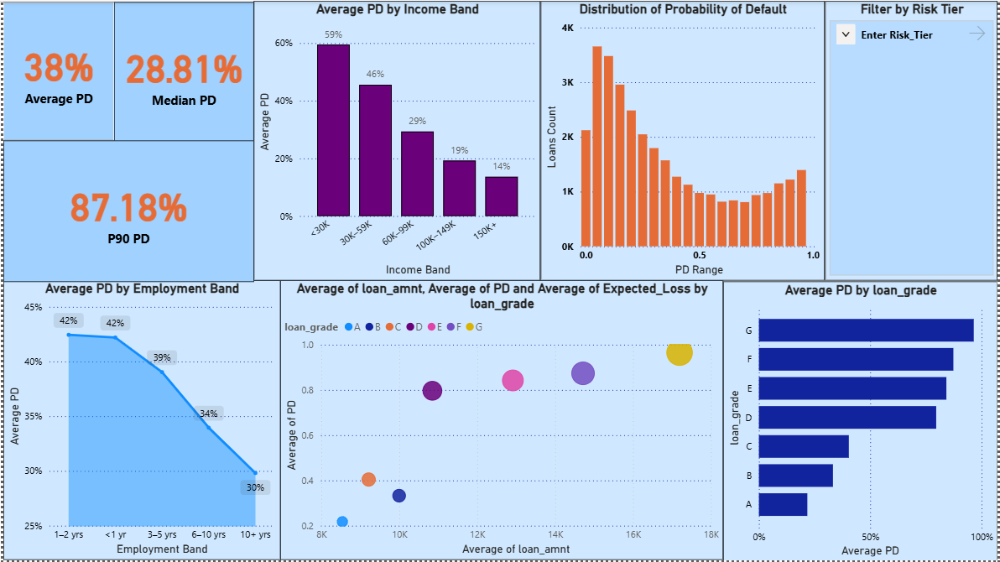
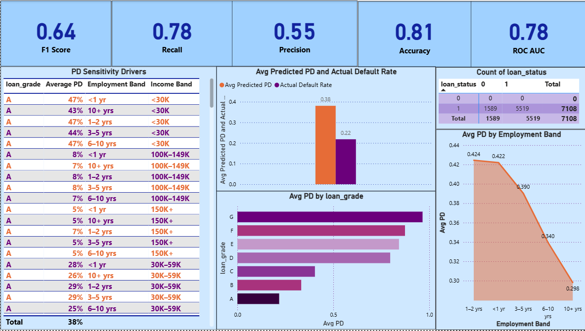

# Credit Risk Model Validation & Governance Dashboard

---

## 🛠️ Tools & Technologies Used

  
  
  
  
  

---

## 📊 Dashboard Preview

  

  

  

---

## 📌 Risk Framework Overview

This project implements a structured credit risk framework:

- **Probability of Default (PD):** Model-based estimation of borrower default risk  
- **Exposure at Default (EAD):** Outstanding loan amount at risk  
- **Loss Given Default (LGD):** Assumed recovery-adjusted loss rate (45%)  
- **Expected Loss (EL):** 
  `EL = Probability of Default × Loss Given Default × Exposure at Default`

The dashboard enables portfolio-level monitoring, risk segmentation, model performance tracking, and regulatory-style validation.

---

## 🔎 Model Methodology

The Probability of Default (PD) model was developed using supervised machine learning techniques.

### Model Development Process:
- Data preprocessing and feature engineering
- Handling class imbalance
- Model training using classification algorithms
- Performance evaluation using ROC AUC, Precision, Recall, F1 Score
- Threshold selection for default classification

### Governance Controls:
- Monotonic risk validation across credit grades
- Calibration review (Predicted PD vs Actual Default Rate)
- Confusion matrix monitoring
- Performance metric tracking

This approach aligns with standard credit risk model validation practices and regulatory expectations for explainability and monitoring.

---

## 📊 Data Description

The project utilizes structured loan-level data to develop and validate the Probability of Default (PD) model.

### Credit Dataset Overview:
- Loan amount (Exposure at Default – EAD)
- Interest rate
- Borrower income
- Employment length
- Loan purpose
- Credit grade (A–G)
- Historical default indicator (loan_status)

### Target Variable:
- `loan_status`
  - 0 = Non-Default  
  - 1 = Default

### Engineered Variables:
- Risk Tier classification (Low / Medium / High)
- Income Bands
- Employment Bands
- Expected Loss (EL)

Data preprocessing included cleaning, handling missing values, and preparing structured features suitable for credit risk modeling.

---

## 📂 Project Structure

| File / Folder | Description |
|---------------|-------------|
| `credit_model.py` | Credit Probability of Default (PD) model training script |
| `fraud_model.py` | Fraud detection model training script |
| `credit_scored.csv` | Scored credit dataset containing PD, EL, and Risk Tier |
| `fraud_scored.csv` | Scored fraud dataset with fraud probabilities |
| `credit_metrics.json` | Credit model performance metrics (ROC, F1, etc.) |
| `fraud_metrics.json` | Fraud model performance metrics |
| `executive_risk_summary.csv` | Portfolio-level KPIs and summary metrics |
| `make_visualizations.py` | Script used to generate analytics visualizations |
| `images/` | Dashboard screenshots for README display |
| `visualizations/` | Generated charts and analysis outputs |
| `Risk & Credit.pbix` | Power BI dashboard file |

---

Built for Risk & Credit Analytics Roles  
Focused on PD Modeling, Expected Loss, and Model Governance  

© 2025 Chandan Seelam ❤️❤️

